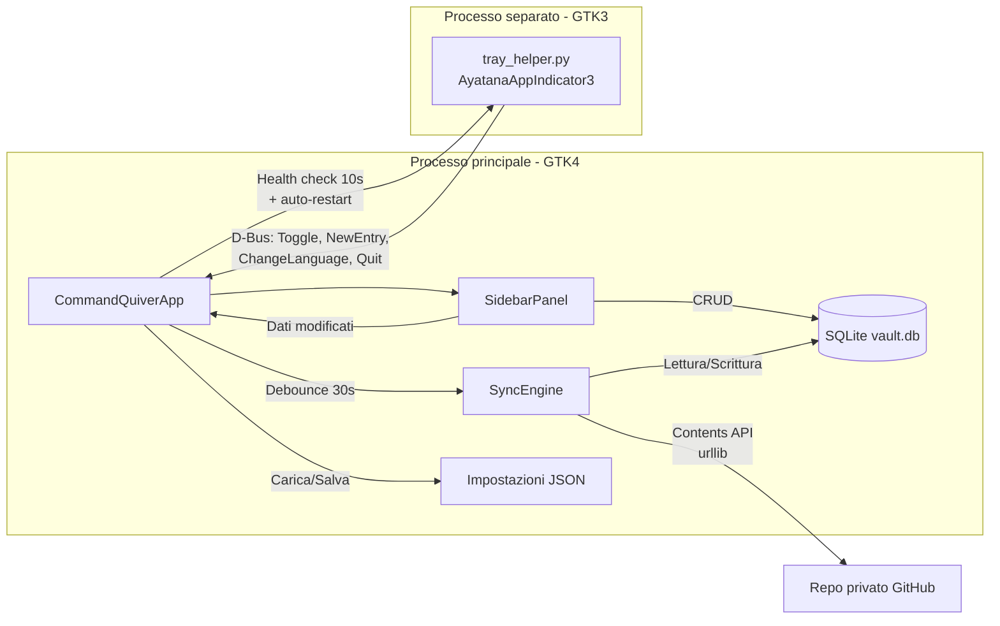
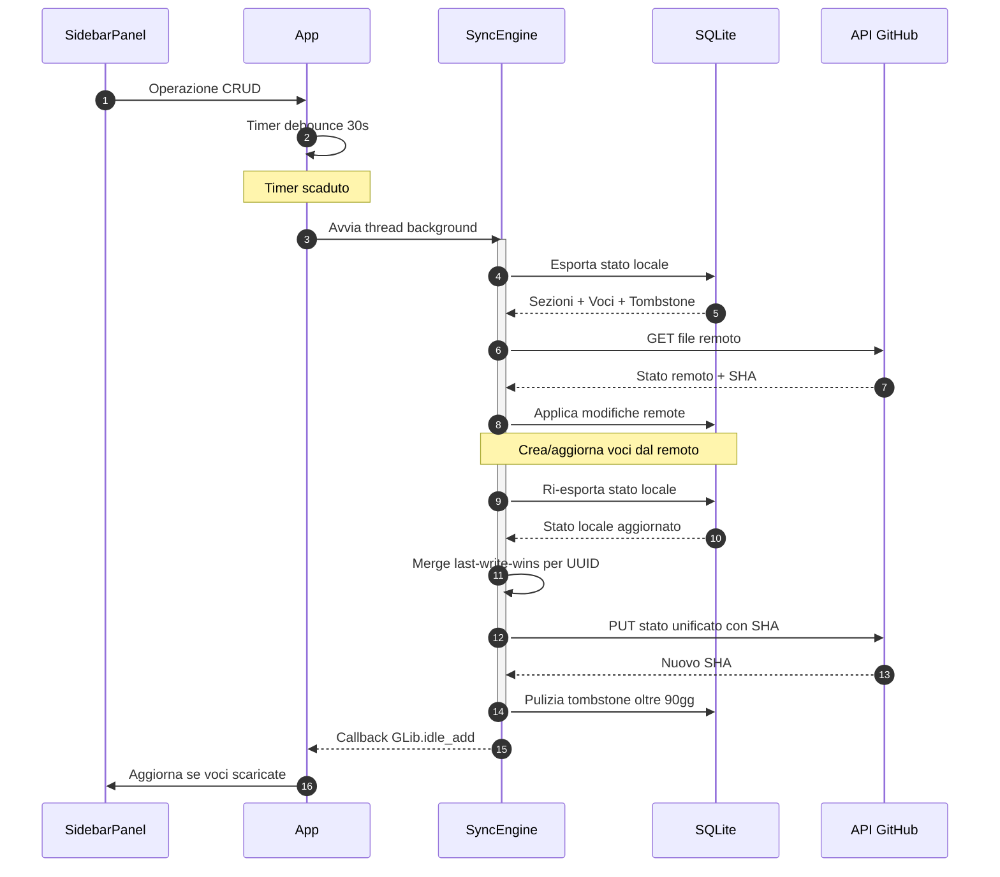

[English](README.md) | **Italiano**

# Command Quiver by Bonn

Libreria personale di prompt AI e comandi shell, accessibile dalla system tray di GNOME. Cerca, organizza in sezioni, copia negli appunti o esegui nel terminale.

<div align="center">

[](https://github.com/AndreaBonn/command-quiver/actions/workflows/ci.yml)
[](https://github.com/AndreaBonn/command-quiver/actions/workflows/ci.yml)
[](https://github.com/AndreaBonn/command-quiver/actions/workflows/ci.yml)
[](https://docs.astral.sh/ruff/)
[](LICENSE)
[](SECURITY.md)

</div>

## Panoramica

Command Quiver by Bonn vive nella system tray di GNOME e offre accesso rapido a prompt AI e comandi shell usati di frequente. Le voci sono salvate in un database SQLite locale, organizzate in sezioni e ricercabili per nome. I prompt vengono copiati negli appunti; i comandi shell possono essere eseguiti direttamente in gnome-terminal.

## Architettura



> Per diagrammi tecnici dettagliati (schema database, macchine a stati, gerarchia componenti UI), vedi [docs/ARCHITECTURE.it.md](docs/ARCHITECTURE.it.md).

## Funzionalità

- Icona nella system tray con menu contestuale (mostra/nascondi, nuova voce, esci)
- Pannello laterale con ricerca e ordinamento multiplo (alfabetico, cronologico, personalizzato)
- Due tipi di voce: prompt AI (copia negli appunti) e comandi shell (esegui nel terminale)
- Sezioni per organizzare le voci, con riordinamento drag-and-drop
- Interfaccia bilingue (italiano / inglese) con cambio lingua live
- Persistenza SQLite con WAL mode e recovery automatico da corruzione
- Singola istanza garantita via D-Bus
- Impostazioni persistenti (ordinamento, dimensione finestra, lingua, tema)
- Sincronizzazione tra dispositivi tramite repository privato GitHub

## Sincronizzazione multi-dispositivo

Command Quiver permette di sincronizzare voci e sezioni tra piu computer usando un repository privato GitHub come storage. Non servono dipendenze esterne -- la sincronizzazione usa solo la libreria standard Python.

### Come funziona

- All'avvio, l'app scarica dal repository remoto e integra le nuove voci
- Dopo ogni modifica (creazione, modifica, cancellazione), l'app invia le modifiche al repository entro 30 secondi
- Alla chiusura, viene eseguita una sincronizzazione finale
- I conflitti si risolvono automaticamente: vince la modifica piu recente
- Le cancellazioni si propagano a tutti i dispositivi

### Flusso di sincronizzazione



### Configurazione

#### 1. Crea un repository privato su GitHub

1. Vai su [github.com/new](https://github.com/new)
2. Imposta **Repository name** su `command-quiver-sync` (o qualsiasi nome)
3. Imposta **Visibility** su **Private**
4. **Non** spuntare "Add a README" -- il repository deve essere vuoto
5. Clicca **Create repository**

#### 2. Crea un Personal Access Token

1. Vai su [github.com/settings/tokens?type=beta](https://github.com/settings/tokens?type=beta) (Fine-grained tokens)
2. Clicca **Generate new token**
3. Imposta **Token name** su `command-quiver-sync`
4. Imposta **Expiration** a piacere (1 anno consigliato)
5. In **Repository access**, seleziona **Only select repositories** e scegli il tuo repository di sync
6. In **Permissions > Repository permissions**, imposta **Contents** su **Read and write**
7. Clicca **Generate token**
8. Copia il token (inizia con `github_pat_...`) -- lo vedrai solo questa volta

#### 3. Configura in Command Quiver

1. Apri Command Quiver
2. Clicca l'icona sync (ingranaggio) nell'angolo in basso a destra
3. Compila i campi:
   - **Proprietario repo**: il tuo username GitHub
   - **Nome repo**: `command-quiver-sync`
   - **Token**: incolla il token dal passo 2
4. Clicca **Testa connessione** per verificare
5. Se la connessione riesce, clicca **Attiva sync**

#### 4. Configura gli altri computer

Ripeti il passo 3 su ogni computer (usa lo stesso repository e token). Al primo avvio con sync attivo, l'app scarica tutte le voci dal repository e le integra con i dati locali.

### Percorsi dei dati di sync

| Percorso | Contenuto |
|---|---|
| `~/.config/command-quiver/settings.json` | Configurazione sync (repo, stato) |
| `~/.config/command-quiver/.sync_token` | Token GitHub (permessi file: 600) |

## Requisiti

- Python >= 3.10
- GTK4 e PyGObject
- AyatanaAppIndicator3 (per icona nella system tray)
- gnome-terminal (per esecuzione comandi shell)
- pycairo (per generazione icona)

Su Ubuntu/Debian:

```bash
sudo apt install python3-gi python3-gi-cairo gir1.2-gtk-4.0 \
    gir1.2-ayatanaappindicator3-0.1 gnome-terminal
```

## Installazione

```bash
git clone https://github.com/AndreaBonn/command-quiver.git
cd command-quiver
uv sync
```

## Utilizzo

Avvia l'applicazione:

```bash
uv run python command_quiver/main.py
```

L'icona tray appare nella barra superiore di GNOME. Click sinistro per mostrare/nascondere la sidebar, click destro per il menu contestuale.

Dalla sidebar:

- Click su **+ Nuova voce** per creare un prompt o un comando shell
- Click su una voce per copiarla negli appunti (prompt) o eseguirla (comandi shell)
- Usa la barra di ricerca per filtrare le voci per nome
- Cambia ordinamento dal dropdown (Recenti, A-Z, Z-A, Personale)
- Gestisci le sezioni con **+ Sezione**, oppure click destro su una sezione per rinominare/eliminare

### Percorsi dei dati

| Percorso | Contenuto |
|---|---|
| `~/.local/share/command-quiver/vault.db` | Database SQLite |
| `~/.config/command-quiver/settings.json` | Impostazioni utente |
| `~/.local/share/command-quiver/logs/` | Log applicazione |

## Test

```bash
uv run pytest
```

Con copertura:

```bash
uv run pytest --cov=command_quiver
```

Lint:

```bash
uv run ruff check .
```

## Contribuire

I contributi sono benvenuti. Apri una issue per discutere la modifica prima di inviare un pull request. Segui lo stile del codice esistente (configurazione ruff in `pyproject.toml`) e includi test per le nuove funzionalità.

## Sicurezza

Per segnalare vulnerabilità, consulta la [policy di sicurezza](SECURITY.it.md).

## Licenza

Rilasciato sotto licenza Apache 2.0 -- vedi [LICENSE](LICENSE).

## Autore

Andrea Bonacci -- [@AndreaBonn](https://github.com/AndreaBonn)

---

Se questo progetto ti è utile, una stella su GitHub è apprezzata.
