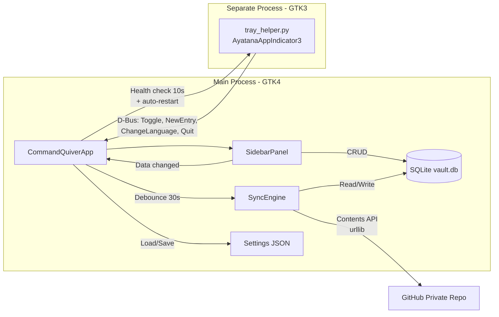
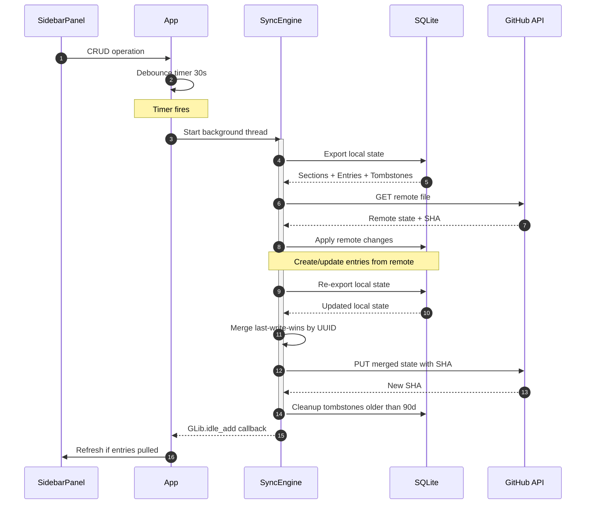

**English** | [Italiano](README.it.md)

# Command Quiver by Bonn

A personal library of AI prompts and shell commands, accessible from the GNOME system tray. Search, organize by sections, copy to clipboard or execute in terminal.

<div align="center">

[](https://github.com/AndreaBonn/command-quiver/actions/workflows/ci.yml)
[](https://github.com/AndreaBonn/command-quiver/actions/workflows/ci.yml)
[](https://github.com/AndreaBonn/command-quiver/actions/workflows/ci.yml)
[](https://docs.astral.sh/ruff/)
[](LICENSE)
[](SECURITY.md)

</div>

## Overview

Command Quiver by Bonn lives in your GNOME system tray and gives you quick access to frequently used AI prompts and shell commands. Entries are stored in a local SQLite database, organized into sections, and searchable by name. Prompts are copied to the clipboard; shell commands can be executed directly in gnome-terminal.

## Architecture



> For detailed technical diagrams (database schema, state machines, UI component tree), see [docs/ARCHITECTURE.md](docs/ARCHITECTURE.md).

## Features

- System tray icon with context menu (show/hide, new entry, quit)
- Sidebar panel with search and multiple sort modes (alphabetical, chronological, custom)
- Two entry types: AI prompts (copy to clipboard) and shell commands (run in terminal)
- Sections for organizing entries, with drag-and-drop reordering
- Bilingual interface (Italian / English) with live language switching
- SQLite persistence with WAL mode and automatic recovery from corruption
- Single-instance enforcement via D-Bus
- Persistent settings (sort order, window size, language, theme)
- Cross-device sync via GitHub private repository

## Multi-Device Sync

Command Quiver can sync your entries and sections across multiple computers using a private GitHub repository as storage. No external dependencies are needed -- syncing uses only the Python standard library.

### How it works

- On startup, the app pulls from the remote repo and merges new entries
- After each change (create, edit, delete), the app pushes to the repo within 30 seconds
- On shutdown, a final sync is performed
- Conflicts are resolved automatically: the most recent edit wins
- Deletions propagate to all devices

### Sync flow



### Setup

#### 1. Create a private GitHub repository

1. Go to [github.com/new](https://github.com/new)
2. Set **Repository name** to `command-quiver-sync` (or any name you prefer)
3. Set **Visibility** to **Private**
4. Do **not** check "Add a README" -- the repository must be empty
5. Click **Create repository**

#### 2. Create a Personal Access Token

1. Go to [github.com/settings/tokens?type=beta](https://github.com/settings/tokens?type=beta) (Fine-grained tokens)
2. Click **Generate new token**
3. Set **Token name** to `command-quiver-sync`
4. Set **Expiration** to your preference (1 year recommended)
5. Under **Repository access**, select **Only select repositories** and choose your sync repository
6. Under **Permissions > Repository permissions**, set **Contents** to **Read and write**
7. Click **Generate token**
8. Copy the token (starts with `github_pat_...`) -- you will only see it once

#### 3. Configure in Command Quiver

1. Open Command Quiver
2. Click the sync icon (gear) in the bottom-right corner
3. Fill in the fields:
   - **Repo owner**: your GitHub username
   - **Repo name**: `command-quiver-sync`
   - **Token**: paste the token from step 2
4. Click **Test connection** to verify
5. If successful, click **Enable sync**

#### 4. Set up additional computers

Repeat step 3 on each computer (use the same repository and token). On first launch with sync enabled, the app downloads all entries from the repo and merges them with local data.

### Sync data locations

| Path | Content |
|---|---|
| `~/.config/command-quiver/settings.json` | Sync configuration (repo, status) |
| `~/.config/command-quiver/.sync_token` | GitHub token (file permissions: 600) |

## Requirements

- Python >= 3.10
- GTK4 and PyGObject
- AyatanaAppIndicator3 (for system tray icon)
- gnome-terminal (for shell command execution)
- pycairo (for icon generation)

On Ubuntu/Debian:

```bash
sudo apt install python3-gi python3-gi-cairo gir1.2-gtk-4.0 \
    gir1.2-ayatanaappindicator3-0.1 gnome-terminal
```

## Installation

```bash
git clone https://github.com/AndreaBonn/command-quiver.git
cd command-quiver
uv sync
```

## Usage

Start the application:

```bash
uv run python command_quiver/main.py
```

The tray icon appears in the GNOME top bar. Left-click to toggle the sidebar, right-click for the context menu.

From the sidebar:

- Click **+ New entry** to create a prompt or shell command
- Click an entry to copy it to the clipboard (prompts) or execute it (shell commands)
- Use the search bar to filter entries by name
- Switch sort mode with the dropdown (Recent, A-Z, Z-A, Custom)
- Manage sections with **+ Section**, or right-click a section to rename/delete

### Data locations

| Path | Content |
|---|---|
| `~/.local/share/command-quiver/vault.db` | SQLite database |
| `~/.config/command-quiver/settings.json` | User settings |
| `~/.local/share/command-quiver/logs/` | Application logs |

## Testing

```bash
uv run pytest
```

With coverage:

```bash
uv run pytest --cov=command_quiver
```

Lint:

```bash
uv run ruff check .
```

## Contributing

Contributions are welcome. Open an issue to discuss the change before submitting a pull request. Follow the existing code style (ruff configuration in `pyproject.toml`) and include tests for new functionality.

## Security

For reporting vulnerabilities, see the [security policy](SECURITY.md).

## License

Released under the Apache License 2.0 -- see [LICENSE](LICENSE).

## Author

Andrea Bonacci -- [@AndreaBonn](https://github.com/AndreaBonn)

---

If this project is useful to you, a star on GitHub is appreciated.
