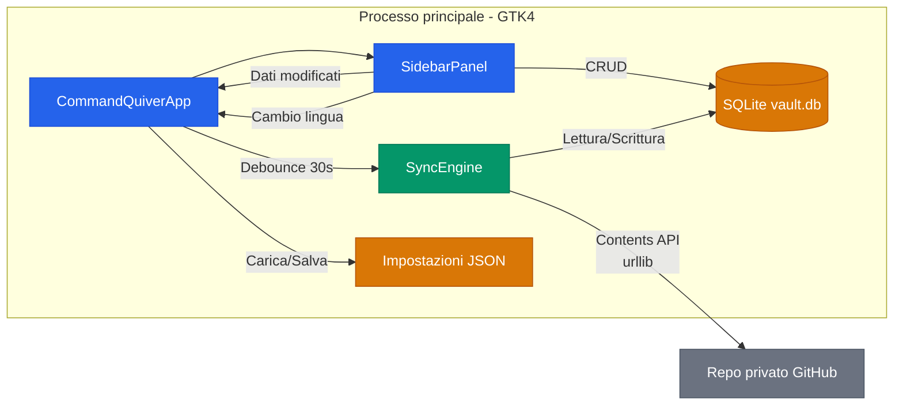
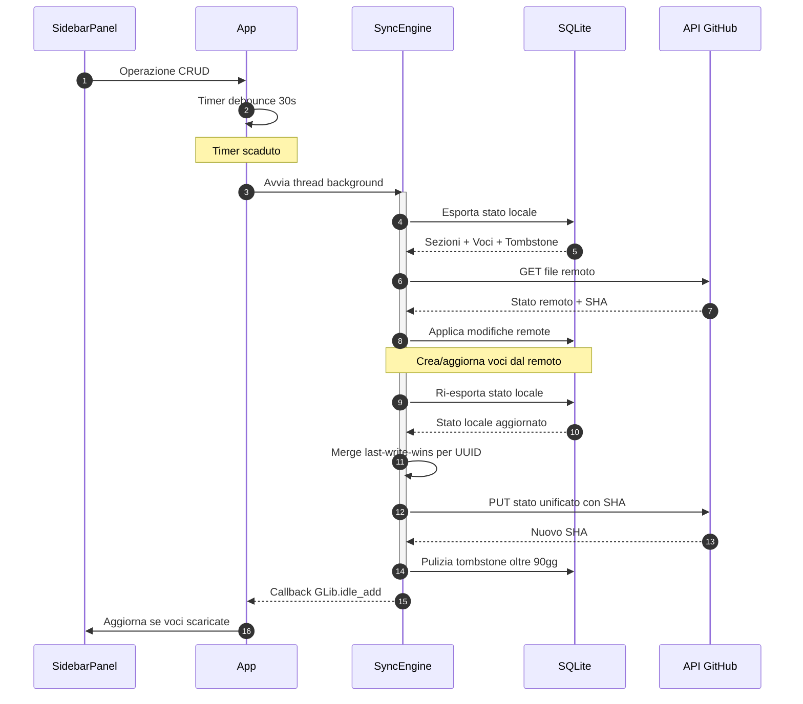
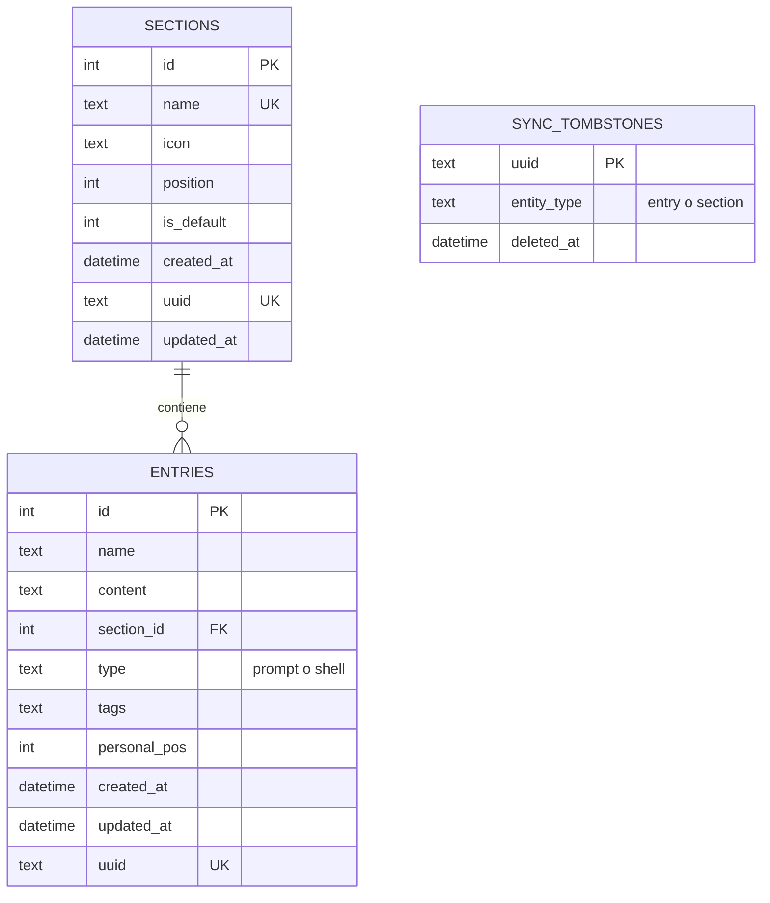
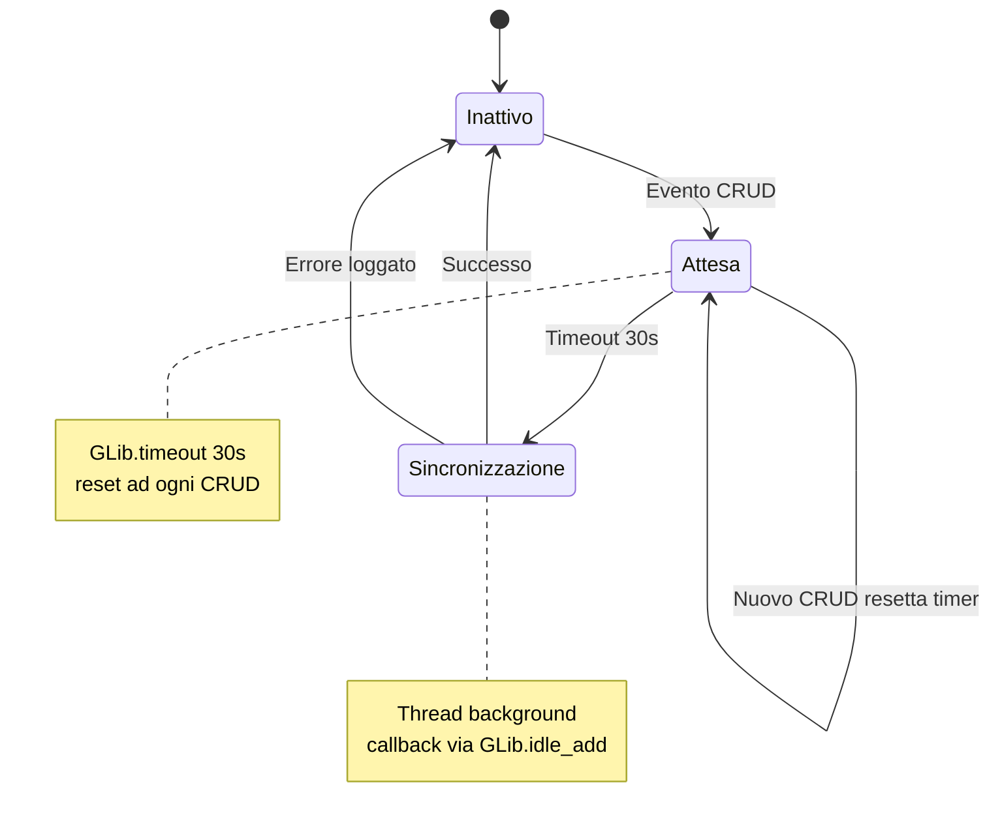
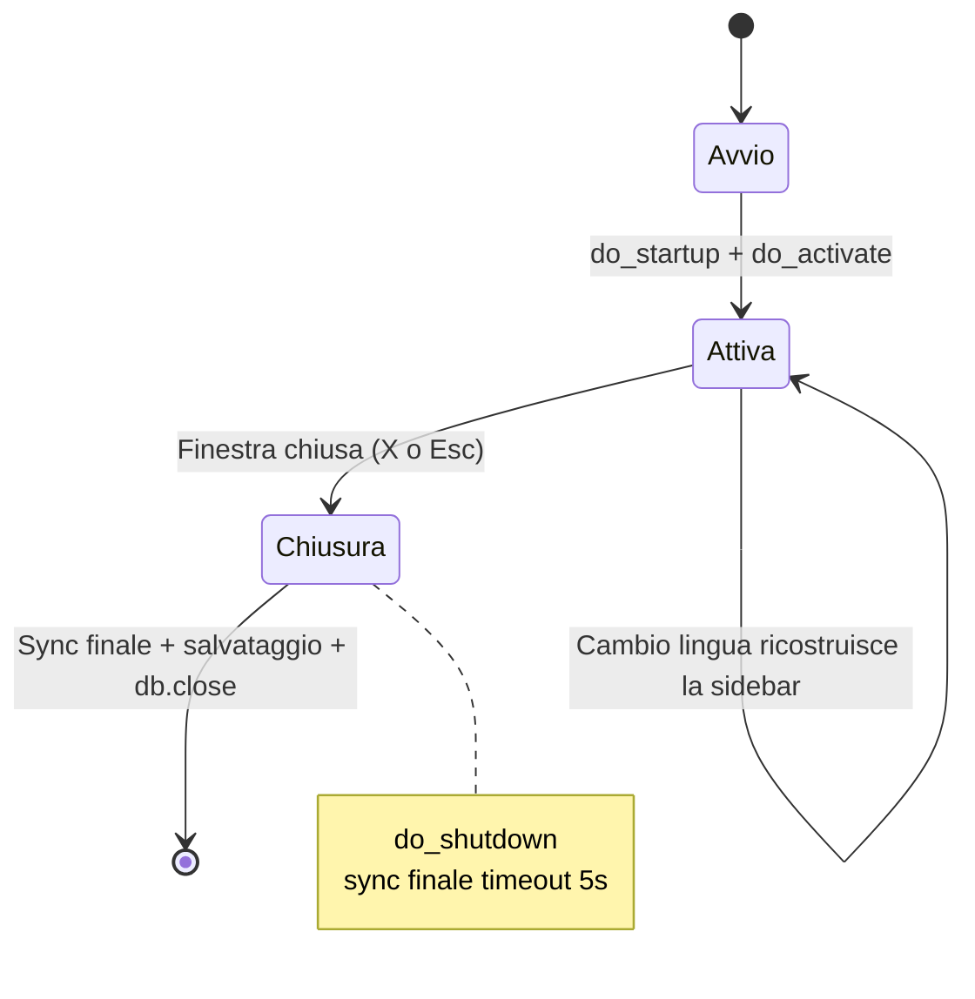

[English](ARCHITECTURE.md) | **Italiano**

# Architettura tecnica

Reference tecnico con diagrammi dettagliati degli internals di Command Quiver.

## Architettura di sistema

Processo principale GTK4 e sync GitHub via Contents API.

## Flusso di sincronizzazione

Sequenza sync cross-device: le operazioni CRUD attivano un debounce di 30s, poi export-pull-merge-push in un thread background.

## Schema database

Tre tabelle: sections e entries (con UUID per identita cross-device), piu tombstones per la propagazione delle cancellazioni.

## Macchine a stati

### Debounce sincronizzazione

Gli eventi CRUD avviano un timer debounce di 30s. Ogni nuovo CRUD lo resetta. Quando il timer scade, la sync gira in un thread background e ritorna via `GLib.idle_add`.

### Ciclo di vita dell'applicazione

La finestra principale e l'applicazione: chiudendola (pulsante di chiusura o `Esc`) viene eseguita una sincronizzazione finale, salvato lo stato e l'app termina via `do_shutdown`.

## Gerarchia componenti UI

Albero widget GTK4.

```mermaid
%%{init: {'theme': 'default'}}%%
graph TD
  app["CommandQuiverApp<br/>Gtk.Application"]
  sidebar["SidebarPanel<br/>Gtk.Window"]
  search["Campo ricerca"]
  paned["Gtk.Paned"]
  section_panel["SectionPanelWidget"]
  section_list["Lista sezioni"]
  new_section["Btn nuova sezione<br/>&#8594; SectionCreateDialog"]
  right_panel["Pannello destro"]
  entry_list["EntryListWidget"]
  entry_row["EntryRow x N<br/>nome | badge | copia | modifica | esegui"]
  sort_dd["Ordinamento DropDown<br/>5 opzioni"]
  bottom_bar["Barra inferiore"]
  new_entry["Btn nuova voce<br/>&#8594; EntryEditorDialog"]
  lang_dd["DropDown lingua<br/>IT / EN"]
  sync_btn["Btn sync<br/>&#8594; SyncSetupDialog"]
  sync_label["Stato sincronizzazione"]

  app --> sidebar
  sidebar --> search
  sidebar --> paned
  sidebar --> bottom_bar
  paned --> section_panel
  paned --> right_panel
  section_panel --> section_list
  section_panel --> new_section
  right_panel --> entry_list
  right_panel --> sort_dd
  entry_list --> entry_row
  bottom_bar --> new_entry
  bottom_bar --> lang_dd
  bottom_bar --> sync_btn
  bottom_bar --> sync_label

  classDef root fill:#1d4ed8,stroke:#1e40af,color:#fff
  classDef container fill:#2563eb,stroke:#1d4ed8,color:#fff
  classDef leaf fill:#bfdbfe,stroke:#3b82f6,color:#1e3a5f
  classDef action fill:#d97706,stroke:#b45309,color:#fff

  class app root
  class sidebar,paned,section_panel,right_panel,bottom_bar container
  class search,section_list,entry_list,entry_row,sort_dd,sync_label,lang_dd leaf
  class new_section,new_entry,sync_btn action
```

