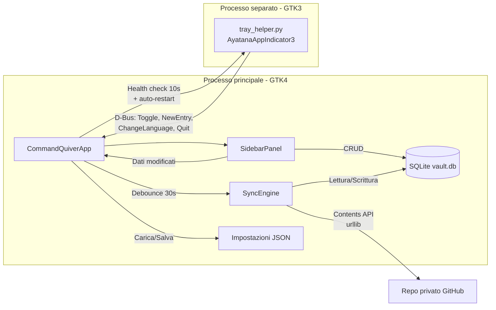
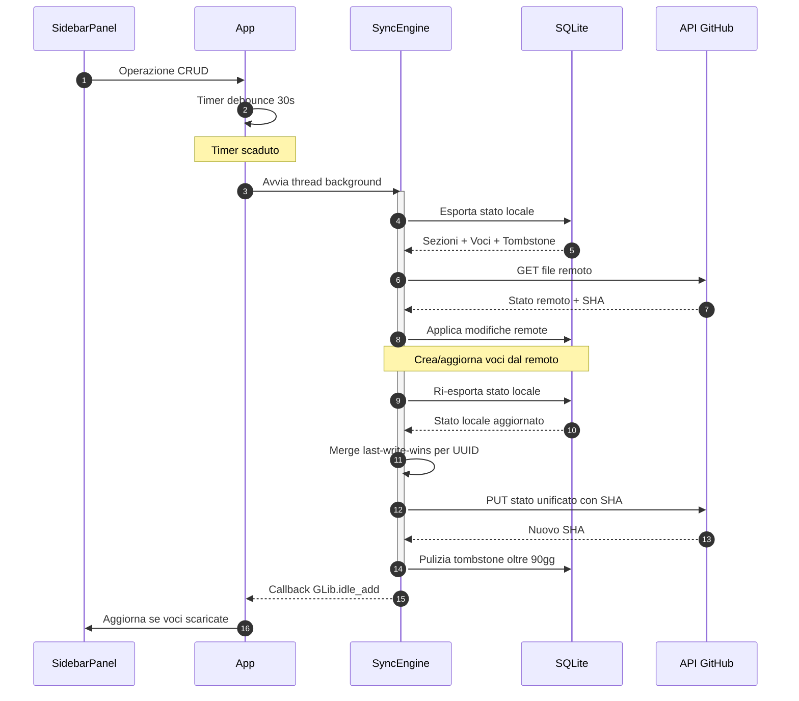
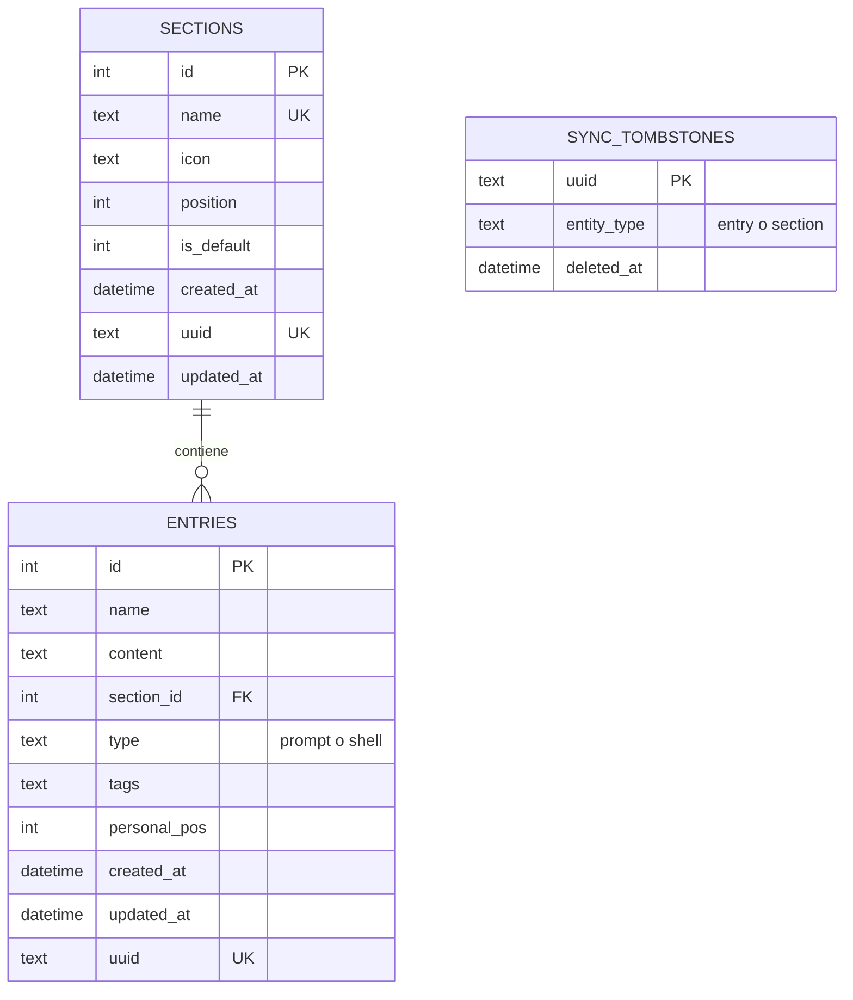
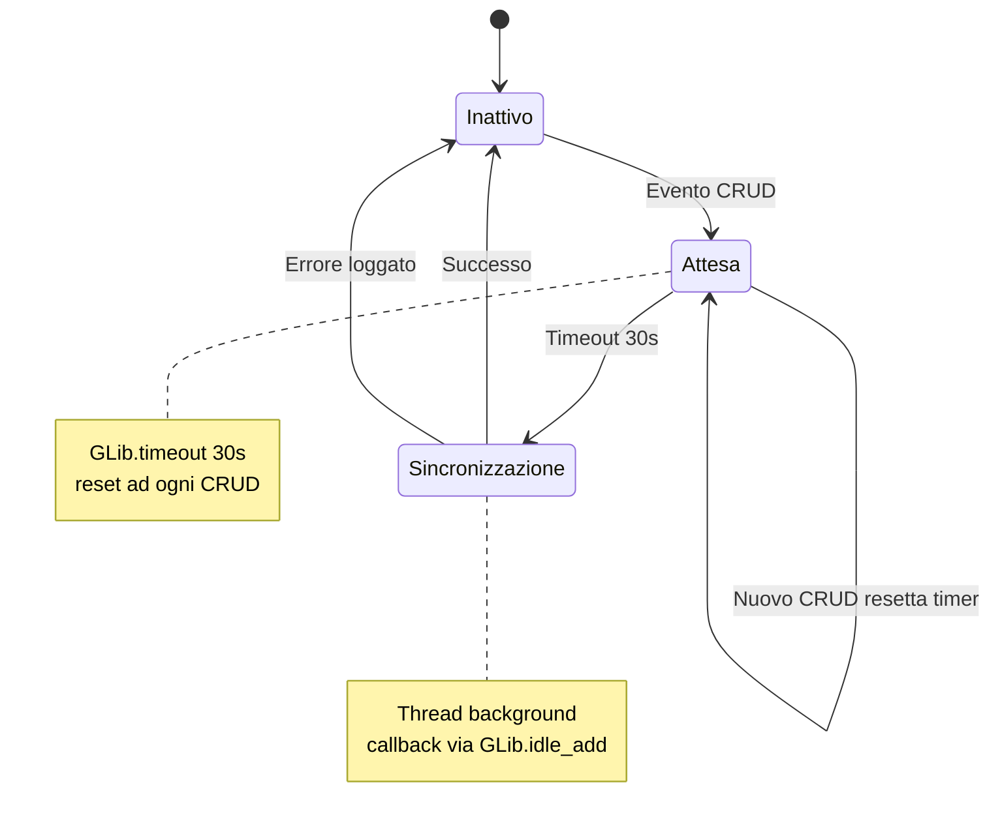
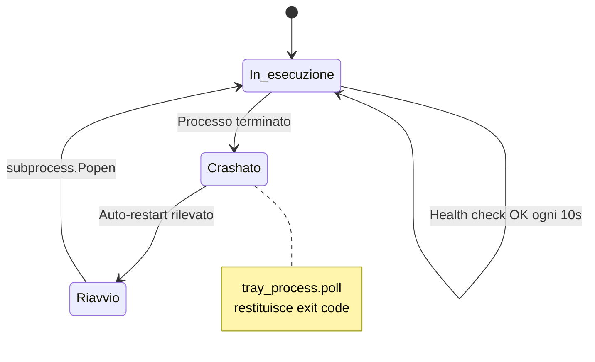

[English](ARCHITECTURE.md) | **Italiano**

# Architettura tecnica

Reference tecnico con diagrammi dettagliati degli internals di Command Quiver.

## Architettura di sistema

Processo principale GTK4, processo tray GTK3 (separato per compatibilita), e sync GitHub via Contents API.

## Flusso di sincronizzazione

Sequenza sync cross-device: le operazioni CRUD attivano un debounce di 30s, poi export-pull-merge-push in un thread background.

## Schema database

Tre tabelle: sections e entries (con UUID per identita cross-device), piu tombstones per la propagazione delle cancellazioni.

## Macchine a stati

### Debounce sincronizzazione

Gli eventi CRUD avviano un timer debounce di 30s. Ogni nuovo CRUD lo resetta. Quando il timer scade, la sync gira in un thread background e ritorna via `GLib.idle_add`.

### Health check processo tray

Il processo principale verifica il tray helper ogni 10s. Se il processo e terminato, lo riavvia automaticamente via `subprocess.Popen`.

## Gerarchia componenti UI

Albero widget GTK4. Il tray helper gira come processo GTK3 separato, connesso via D-Bus.

```mermaid
graph TD
  app["CommandQuiverApp<br/>Gtk.Application"]
  sidebar["SidebarPanel<br/>Gtk.Window"]
  search["Campo ricerca"]
  paned["Gtk.Paned"]
  section_panel["SectionPanelWidget"]
  section_list["Lista sezioni"]
  new_section["Btn nuova sezione<br/>&#8594; SectionCreateDialog"]
  right_panel["Pannello destro"]
  entry_list["EntryListWidget"]
  entry_row["EntryRow x N<br/>nome | badge | copia | modifica | esegui"]
  sort_dd["Ordinamento DropDown<br/>5 opzioni"]
  bottom_bar["Barra inferiore"]
  new_entry["Btn nuova voce<br/>&#8594; EntryEditorDialog"]
  sync_btn["Btn sync<br/>&#8594; SyncSetupDialog"]
  sync_label["Stato sincronizzazione"]
  tray["tray_helper<br/>processo separato, D-Bus"]

  app --> sidebar
  app -.->|"D-Bus"| tray
  sidebar --> search
  sidebar --> paned
  sidebar --> bottom_bar
  paned --> section_panel
  paned --> right_panel
  section_panel --> section_list
  section_panel --> new_section
  right_panel --> entry_list
  right_panel --> sort_dd
  entry_list --> entry_row
  bottom_bar --> new_entry
  bottom_bar --> sync_btn
  bottom_bar --> sync_label
```

