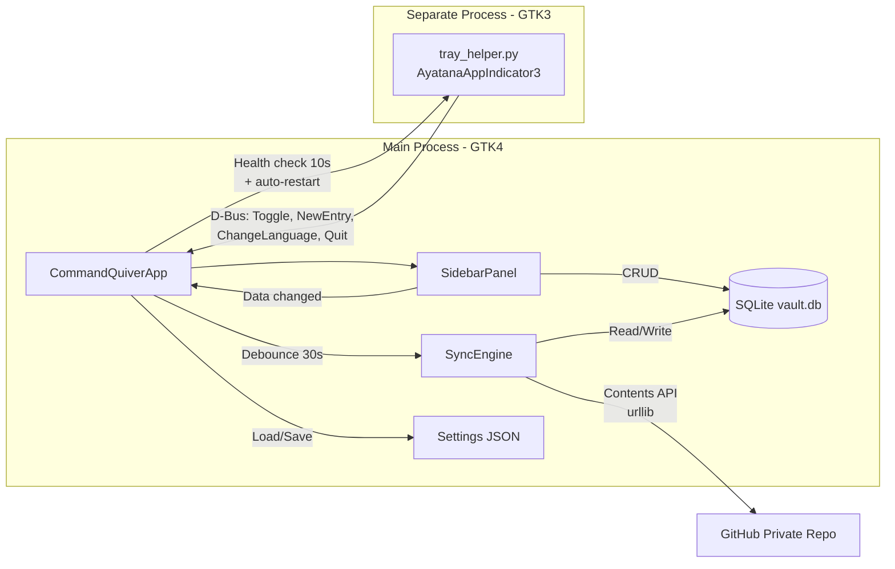
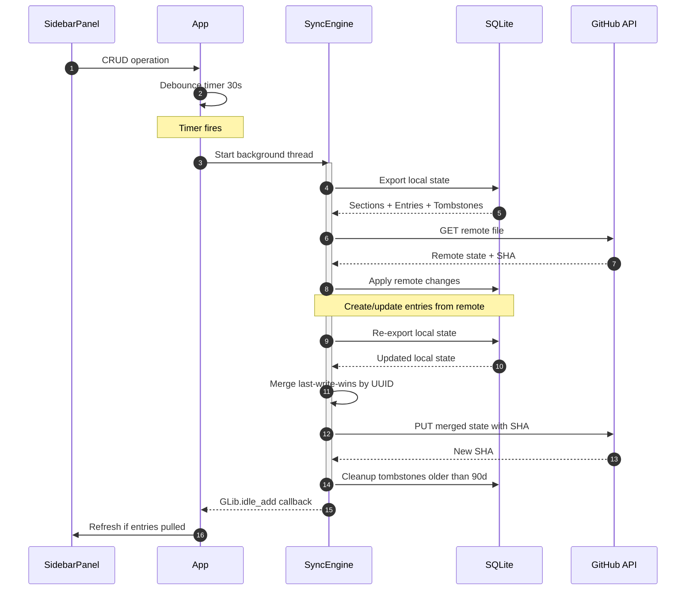
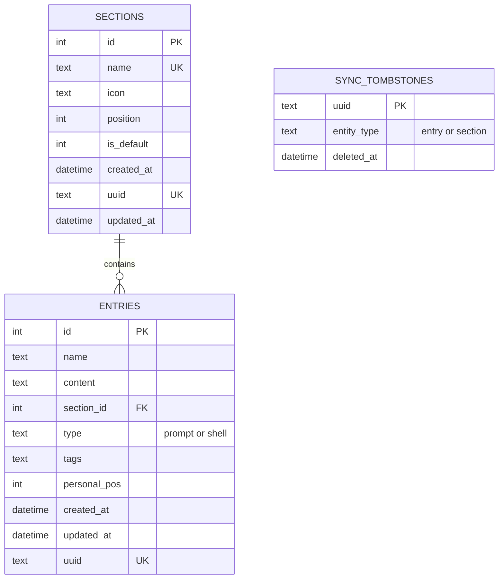
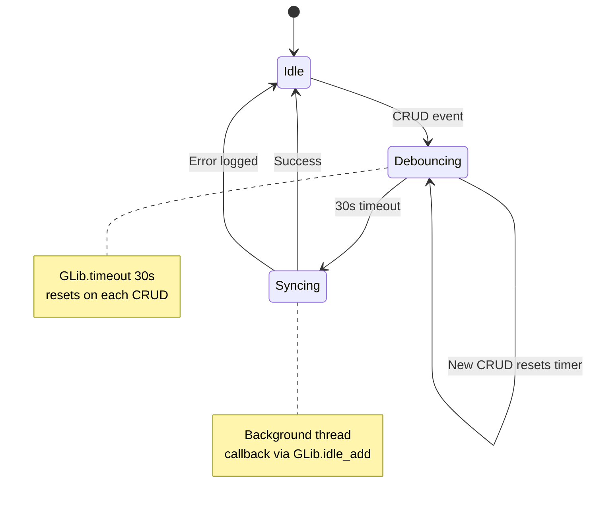
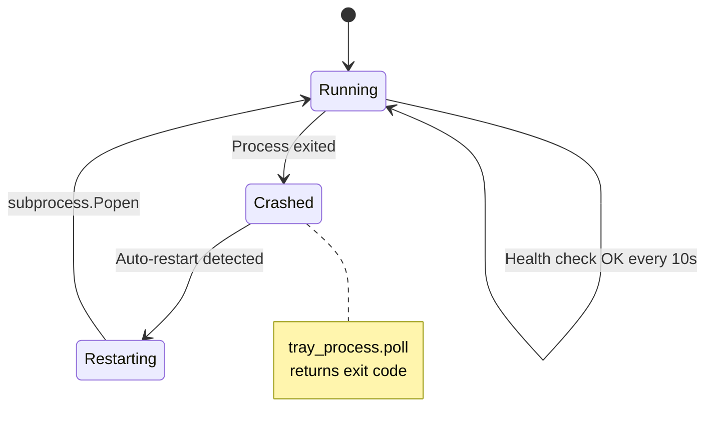

**English** | [Italiano](ARCHITECTURE.it.md)

# Technical Architecture

Developer reference with detailed diagrams of Command Quiver internals.

## System Architecture

GTK4 main process, GTK3 tray process (separate for compatibility), and GitHub sync via Contents API.

## Sync Flow

Cross-device sync sequence: CRUD triggers a 30s debounce, then export-pull-merge-push in a background thread.

## Database Schema

Three tables: sections and entries (with UUID for cross-device identity), plus tombstones for deletion propagation.

## State Machines

### Sync Debounce

CRUD events start a 30s debounce timer. Each new CRUD resets it. When the timer fires, sync runs in a background thread and returns via `GLib.idle_add`.

### Tray Process Health Check

The main process polls the tray helper every 10s. If the process has exited, it auto-restarts via `subprocess.Popen`.

## UI Component Hierarchy

GTK4 widget tree. The tray helper runs as a separate GTK3 process, connected via D-Bus.

```mermaid
graph TD
  app["CommandQuiverApp<br/>Gtk.Application"]
  sidebar["SidebarPanel<br/>Gtk.Window"]
  search["SearchEntry"]
  paned["Gtk.Paned"]
  section_panel["SectionPanelWidget"]
  section_list["Section ListBox"]
  new_section["New Section btn<br/>&#8594; SectionCreateDialog"]
  right_panel["Right Panel"]
  entry_list["EntryListWidget"]
  entry_row["EntryRow x N<br/>name | badge | copy | edit | exec"]
  sort_dd["Sort DropDown<br/>5 options"]
  bottom_bar["Bottom Bar"]
  new_entry["New Entry btn<br/>&#8594; EntryEditorDialog"]
  sync_btn["Sync btn<br/>&#8594; SyncSetupDialog"]
  sync_label["Sync status label"]
  tray["tray_helper<br/>separate process, D-Bus"]

  app --> sidebar
  app -.->|"D-Bus"| tray
  sidebar --> search
  sidebar --> paned
  sidebar --> bottom_bar
  paned --> section_panel
  paned --> right_panel
  section_panel --> section_list
  section_panel --> new_section
  right_panel --> entry_list
  right_panel --> sort_dd
  entry_list --> entry_row
  bottom_bar --> new_entry
  bottom_bar --> sync_btn
  bottom_bar --> sync_label
```

